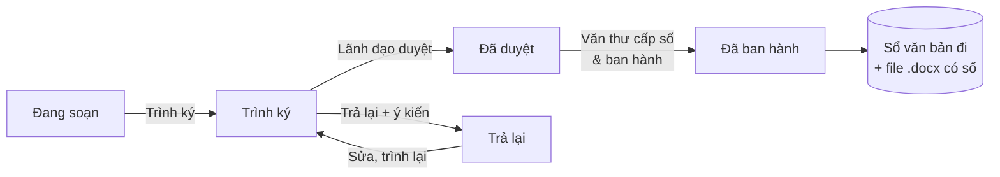

# TÀI LIỆU MÔ TẢ MODULE QUẢN LÝ HÀNH CHÍNH (QLHC)

**Đơn vị:** Trung tâm Dịch vụ và Đào tạo theo nhu cầu xã hội – Trường Đại học Y Dược Cần Thơ
**Tích hợp vào:** Cổng Đào tạo CTUMP (`index_QLDT_CSCE.html`)
**Phiên bản:** 1.0.0
**Công nghệ:** PHP 7.4–8.3 và MySQL 5.7+ / MariaDB 10.3+, không dùng thư viện ngoài

---

## 1. Bối cảnh và nguồn tham khảo

Module được xây dựng theo ý tưởng của trang **Trợ lý văn thư** (trolyvanthu.isavn.edu.vn) thuộc hệ sinh thái Viện ISA. Trang tham khảo có các chức năng sau:

| Chức năng của trang tham khảo | Mô tả |
|---|---|
| Tra cứu thể thức | Hai tab: **Văn bản hành chính** (Nghị định 30/2020/NĐ-CP) và **Văn bản của Đảng** (Hướng dẫn 05-HD/VPTW ngày 27/5/2026). |
| Các khối tra cứu | Khổ giấy, lề, phông chữ; cỡ chữ và kiểu chữ từng thành phần; chữ viết tắt tên loại văn bản; quy tắc viết hoa; ghi ngày tháng và quyền hạn ký; nơi nhận, chữ ký, dấu. |
| Công cụ chuẩn hóa | Chuẩn hóa văn bản theo các quy tắc trên (lề công cụ dùng 20/20/30/15 mm). Phần này cần đăng nhập. |
| Tiện ích | Chuyển ngôn ngữ VI/EN, đếm lượt xem, chia sẻ, giới thiệu hệ sinh thái ISA. |

Module QLHC kế thừa phần **tra cứu thể thức** và **chuẩn hóa văn bản**. Module bổ sung thêm các nghiệp vụ văn thư mà Trung tâm cần: soạn thảo theo mẫu, trình ký, sổ văn bản đi và đến, thư viện biểu mẫu.

---

## 2. Mục tiêu

1. Chuẩn hóa thể thức mọi văn bản do Trung tâm ban hành theo NĐ 30/2020 và HD 05-HD/VPTW.
2. Số hóa sổ văn bản đi và đến, cấp số tự động và không trùng.
3. Rút ngắn thời gian soạn thảo nhờ mẫu soạn sẵn cho các văn bản thường dùng (mở lớp, công nhận hoàn thành khóa học, thông báo chiêu sinh…).
4. Theo dõi tiến độ xử lý văn bản đến, cảnh báo văn bản sắp hạn và quá hạn.
5. Cung cấp văn bản, biểu mẫu công khai cho học viên ngay trên Cổng Đào tạo.

---

## 3. Kiến trúc

### 3.1. Sơ đồ tổng quát

```mermaid
flowchart LR
  A[Cổng Đào tạo<br>index_QLDT_CSCE.html] -->|Menu "Hành chính"| B[qlhc/]
  B --> C[Trang công khai<br>Tra cứu · Biểu mẫu]
  B --> D[Trang nội bộ<br>đăng nhập]
  D --> E[(MySQL<br>bảng hc_*)]
  D --> F[uploads/<br>file văn bản]
  D --> G[Bộ dựng .docx<br>ZipArchive]
```

### 3.2. Cấu trúc thư mục

```
qlhc/
├── install.php            Trình cài đặt qua web
├── install.sql            Lược đồ CSDL + dữ liệu mặc định
├── config.sample.php      Mẫu cấu hình
├── index.php              Tổng quan (dashboard)
├── soan-thao.php          Soạn thảo + trình ký, duyệt, ban hành
├── van-ban-di.php         Sổ văn bản đi
├── van-ban-den.php        Sổ văn bản đến
├── kiem-tra.php           Kiểm tra & chuẩn hóa file .docx
├── tra-cuu.php            Tra cứu thể thức (công khai)
├── bieu-mau.php           Văn bản - Biểu mẫu (công khai)
├── danh-muc.php           Danh mục & cài đặt
├── nguoi-dung.php         Quản lý tài khoản
├── nhat-ky.php            Nhật ký thao tác
├── login.php · logout.php · doi-mat-khau.php
├── includes/
│   ├── bootstrap.php      Khởi tạo, nạp cấu hình
│   ├── helpers.php        CSDL, CSRF, định dạng, cấp số, tệp tin
│   ├── auth.php           Đăng nhập, phân quyền
│   ├── layout.php         Khung giao diện
│   ├── vanban.php         Dựng bố cục văn bản → .docx và bản xem trước HTML
│   ├── kiemtra.php        Bộ kiểm tra & chuẩn hóa thể thức
│   ├── nghiepvu.php       Vào sổ, cấp số, mẫu nội dung soạn sẵn
│   └── thethuc.php        Dữ liệu tra cứu thể thức
├── assets/                qlhc.css, qlhc.js
└── uploads/               File tải lên (chặn truy cập trực tiếp)
```

---

## 4. Phân quyền

| Vai trò | Quyền |
|---|---|
| **Quản trị** | Toàn quyền; quản lý danh mục, cài đặt, người dùng, nhật ký; xóa văn bản trong sổ. |
| **Văn thư** | Vào sổ văn bản đi/đến, cấp số, ban hành dự thảo đã duyệt, phân công xử lý, quản lý biểu mẫu. |
| **Lãnh đạo** | Duyệt hoặc trả lại dự thảo; cho ý kiến chỉ đạo, phân công văn bản đến; xem toàn bộ. |
| **Chuyên viên** | Soạn dự thảo của mình; xem sổ văn bản đi; xử lý văn bản đến được giao. |
| **Khách** | Tra cứu thể thức, tải biểu mẫu công khai. |

---

## 5. Chức năng chi tiết

### 5.1. Tra cứu thể thức (công khai)
- Hai tab: **Hành chính (NĐ 30/2020)** và **Đảng (HD 05-HD/VPTW)**.
- Các khối thu gọn/mở rộng:
  - khổ giấy, lề, phông chữ;
  - cỡ chữ và kiểu chữ từng thành phần;
  - chữ viết tắt tên loại văn bản;
  - quy tắc viết hoa;
  - ngày tháng và quyền hạn ký;
  - nơi nhận, chữ ký, dấu.
- Ô **tìm nhanh** lọc theo từ khóa, không phân biệt dấu. Có nút in trang.
- Khối **Áp dụng tại đơn vị** hiển thị tên cơ quan, chữ viết tắt, cách đánh số và danh sách viết tắt đơn vị lấy từ cài đặt.

### 5.2. Soạn thảo văn bản
- Chọn hệ văn bản (Hành chính / Đảng), loại văn bản và đơn vị soạn thảo.
- **Mẫu nội dung soạn sẵn:**
  - Quyết định: mở lớp, công nhận hoàn thành khóa học, thành lập Hội đồng thẩm định;
  - Thông báo chiêu sinh;
  - Giấy mời;
  - Kế hoạch, Báo cáo, Tờ trình;
  - Công văn đề nghị cử giảng viên.
- **Xem trước khổ A4 trực tiếp**, cập nhật ngay khi gõ, đúng bố cục của file Word sẽ xuất.
- Quy tắc nhập nội dung (mỗi dòng là một đoạn):
  - Dòng VIẾT HOA → canh giữa, in đậm (vd: `QUYẾT ĐỊNH:`, `GIÁM ĐỐC …`).
  - `Điều 1.` → tự in đậm phần "Điều 1.".
  - Dòng bắt đầu bằng `Căn cứ`, `Xét đề nghị` → tự in nghiêng.
  - `Phần I`, `Chương II`, `Mục 1` → canh giữa, in đậm.
  - Định dạng trong dòng: `**đậm**`, `_nghiêng_`, `__gạch chân__`.
- Chọn nhanh **mẫu người ký**: quyền hạn (TM./KT./TL./TUQ./Q.; Đảng: T/M, K/T, T/L), chức vụ, họ tên.
- **Xuất .docx** bất kỳ lúc nào, kể cả khi chưa lưu.
- **Quy trình:**



- Khi ban hành, hệ thống cấp số, tạo file Word có **số và ngày chính thức**, lưu vào sổ văn bản đi.
- Có thể **nhân bản** dự thảo để soạn văn bản tương tự.

### 5.3. Sổ văn bản đi
- Danh sách lọc theo năm, hệ, loại, đơn vị, khoảng ngày và từ khóa; có phân trang.
- **Vào sổ thủ công** cho văn bản soạn ngoài hệ thống. Hệ thống hiển thị trước "Số sẽ cấp" và cho phép nhập số tay; số trùng sẽ bị chặn.
- Đính kèm file (PDF, Word, ảnh…): thay thế, gỡ, xem trực tiếp PDF/ảnh.
- **Xuất Excel** (CSV UTF-8, mở được bằng Excel).

### 5.4. Sổ văn bản đến
- Vào sổ với **số đến tự động theo năm**. Ô cơ quan gửi gợi ý từ dữ liệu cũ.
- Các trường: ngày đến, cơ quan gửi, số ký hiệu gốc, ngày văn bản, loại, trích yếu, độ khẩn, file scan.
- **Phân công và chỉ đạo:** người xử lý, đơn vị xử lý, hạn xử lý, ý kiến chỉ đạo.
- **Xử lý:** người được giao cập nhật kết quả và trạng thái (Mới đến → Đang xử lý → Hoàn thành).
- Các tab: Tất cả · Giao cho tôi · Sắp đến hạn · Quá hạn. Văn bản khẩn được đánh dấu đỏ.
- Có xuất Excel.

### 5.5. Kiểm tra thể thức file Word
Tải lên file `.docx`, hệ thống chấm điểm (/100) và liệt kê lỗi, cảnh báo, mục đạt kèm gợi ý sửa.

| Nhóm kiểm tra | Nội dung |
|---|---|
| Trang | Khổ A4, hướng trang, lề (HC: khoảng cho phép; Đảng: 20/20/30/15). |
| Chữ | Phông Times New Roman (kể cả phông mặc định, phông theo theme); cỡ chữ ngoài khoảng. |
| Thành phần | Quốc hiệu, Tiêu ngữ (Đảng: tiêu đề "ĐẢNG CỘNG SẢN VIỆT NAM", dấu sao). |
| Số, ký hiệu | Dấu hai chấm (HC có, Đảng không); số < 10 phải thêm 0. |
| Ngày tháng | Ngày < 10 và tháng 1, 2 thêm số 0; tháng 3–12 không thêm. |
| Nơi nhận | Có "Nơi nhận:", "- Như trên;" (khi có Kính gửi), "- Lưu: VT". |
| Người ký | Cảnh báo khi có học hàm, học vị trước họ tên. |
| Trình bày | Canh đều hai bên; cách dòng Exactly 18–22 pt (Đảng); số trang ở đầu trang, ẩn trang 1. |
| Chính tả | Khoảng trắng kép, khoảng trắng trước dấu câu, một số lỗi viết hoa thường gặp. |

**Chuẩn hóa tự động** (tải bản đã sửa):
- đổi toàn bộ phông sang Times New Roman;
- đặt khổ A4 và lề 20/20/30/15 mm;
- thêm số 0 cho ngày tháng và số văn bản;
- bỏ khoảng trắng kép.

### 5.6. Văn bản - Biểu mẫu
- Trang công khai, nhóm theo chủ đề, có tìm kiếm, xem PDF, tải về, đếm lượt tải.
- Văn thư thêm, sửa, xóa biểu mẫu và đặt từng mẫu là **Công khai** hoặc **Nội bộ** (nội bộ chỉ người đã đăng nhập mới thấy).

### 5.7. Tổng quan (dashboard)
- Thẻ số liệu:
  - văn bản đi trong năm và trong tháng;
  - văn bản đến trong năm và số chưa hoàn thành;
  - số văn bản quá hạn;
  - số dự thảo chờ xử lý.
- Danh sách văn bản đến cần xử lý (màu theo hạn), dự thảo cần thao tác theo vai trò, văn bản đi mới ban hành.
- Biểu đồ số văn bản đi và đến theo 12 tháng.

### 5.8. Quản trị
- **Thông tin cơ quan:**
  - cơ quan chủ quản, cơ quan ban hành, tên viết thường, viết tắt, địa danh;
  - cách đánh số, cỡ chữ nội dung;
  - thông tin Đảng (cơ quan cấp trên, cơ quan ban hành, viết tắt, nhiệm kỳ);
  - số ngày cảnh báo trước hạn.
- **Danh mục:** đơn vị (viết tắt dùng trong ký hiệu công văn), loại văn bản, người ký, bộ đếm số.
- **Người dùng:** tạo tài khoản, phân vai trò, khóa/mở. Người dùng mới bắt buộc đổi mật khẩu lần đầu.
- **Nhật ký:** lọc theo người dùng, đối tượng, nội dung.

---

## 6. Thông số thể thức áp dụng khi xuất file Word

| Thành phần | Văn bản hành chính (NĐ 30) | Văn bản Đảng (HD 05) |
|---|---|---|
| Khổ giấy, lề | A4; trên 20, dưới 20, trái 30, phải 15 mm | A4; 20/20/30/15 mm |
| Phông | Times New Roman | Times New Roman |
| Tiêu đề góc phải | Quốc hiệu 12 đậm + Tiêu ngữ 13 đậm, kẻ ngang dài bằng dòng chữ | "ĐẢNG CỘNG SẢN VIỆT NAM" 15 đậm, kẻ ngang dài bằng tiêu đề |
| Cơ quan | Chủ quản 12; ban hành 12 đậm, kẻ ngang ~40% dòng | Cấp trên 14; ban hành 14 đậm; dấu sao (*) |
| Số, ký hiệu | `Số: 05/QĐ-TTDV` (13) | `Số 05-BC/CB` (14) |
| Địa danh, ngày | 14 nghiêng, thêm số 0 đúng quy tắc | 14 nghiêng |
| Tên loại | 14 in hoa đậm | 16 in hoa đậm |
| Trích yếu | 14 đậm, kẻ ngang dưới; công văn: "V/v …" 12 dưới số | 14 đậm, dưới có "-----"; công văn: "về việc …" 12 nghiêng |
| Kính gửi | Một nơi: canh giữa; nhiều nơi: danh sách gạch đầu dòng | Như HC; tờ trình dùng "Kính trình" |
| Nội dung | 13–14 (cài đặt), canh đều, lùi 1 cm, cách đoạn 6 pt, dòng 1,15 | 14, canh đều, lùi 10 mm, cách đoạn 6 pt, dòng Exactly 20 pt |
| Khối chữ ký | Quyền hạn + chức vụ in hoa đậm 14; họ tên đậm 14 | Quyền hạn đậm 14; chức vụ 14 không đậm; họ tên đậm 14 |
| Nơi nhận | "Nơi nhận:" 12 nghiêng đậm; danh sách 11 | "Nơi nhận:" 14 gạch chân; danh sách 12 |
| Số trang | Giữa lề trên, ẩn ở trang đầu | Giữa lề trên, cách mép 10 mm, ẩn trang đầu |
| Độ khẩn | In hoa đậm dưới số ký hiệu | In hoa đậm 14 dưới số ký hiệu |

---

## 7. Quy tắc cấp số

| Hệ | Phạm vi đánh số | Ký hiệu |
|---|---|---|
| Hành chính – dãy chung (mặc định) | Từ 01 đến hết 31/12, mọi loại văn bản chung một dãy | `05/QĐ-TTDV`, công văn `125/TTDV-ĐT` |
| Hành chính – theo loại | Mỗi loại văn bản một dãy riêng trong năm | như trên |
| Đảng | Mỗi tên loại một dãy riêng trong **nhiệm kỳ cấp ủy** | `Số 05-BC/CB` |
| Văn bản đến | Một dãy theo năm | Số đến 1, 2, 3… |

- Số nhỏ hơn 10 tự thêm số 0 (01, 02…).
- Cấp số trong giao dịch có khóa dòng (`SELECT … FOR UPDATE`) trên bảng bộ đếm, nên không trùng khi nhiều người cấp cùng lúc.
- Khi văn thư nhập số tay, bộ đếm tự đồng bộ lên số lớn nhất.
- Khi sang nhiệm kỳ mới, chỉ cần đổi trường "Nhiệm kỳ" là số văn bản Đảng đánh lại từ 01.

---

## 8. Cơ sở dữ liệu

Các bảng dùng tiền tố `hc_`, mã hóa `utf8mb4_unicode_ci`, nên có thể dùng chung database với web hiện có.

| Bảng | Nội dung | Trường chính |
|---|---|---|
| `hc_nguoi_dung` | Tài khoản | ten_dang_nhap, mat_khau (bcrypt), ho_ten, vai_tro, don_vi_id, kich_hoat, doi_mat_khau |
| `hc_don_vi` | Đơn vị, bộ phận | ten, viet_tat, thu_tu |
| `hc_loai_van_ban` | Loại văn bản (31 HC + 16 Đảng) | he, ten, viet_tat, co_ten_loai |
| `hc_nguoi_ky` | Mẫu người ký | he, ho_ten, chuc_vu, quyen_han, thay_mat |
| `hc_cai_dat` | Cài đặt khóa – giá trị | khoa, gia_tri |
| `hc_bo_dem` | Bộ đếm cấp số | khoa (vd `di:hc:2026`, `den:2026`), gia_tri |
| `hc_du_thao` | Dự thảo | he, loai_id, trich_yeu, du_lieu (JSON), trang_thai, y_kien, van_ban_di_id |
| `hc_van_ban_di` | Sổ văn bản đi | nam, so, pham_vi, so_ky_hieu, ngay_ban_hanh, trich_yeu, nguoi_ky, noi_nhan, tep_tin… (UNIQUE pham_vi + so) |
| `hc_van_ban_den` | Sổ văn bản đến | nam, so_den, ngay_den, co_quan_gui, so_ky_hieu_goc, han_xu_ly, nguoi_xu_ly_id, trang_thai… (UNIQUE nam + so_den) |
| `hc_bieu_mau` | Thư viện biểu mẫu | ten, nhom, tep_tin, cong_khai, luot_tai |
| `hc_nhat_ky` | Nhật ký thao tác | nguoi_dung_id, hanh_dong, doi_tuong, chi_tiet, ip, thoi_gian |

---

## 9. Cài đặt (tóm tắt)

1. Tải thư mục `qlhc/` lên **cùng thư mục** với `index_QLDT_CSCE.html` (vd `public_html/`).
2. Tạo database và user MySQL trong cPanel.
3. Mở `https://ten-mien/qlhc/install.php`, nhập thông tin MySQL và tài khoản quản trị. Có thể thay bằng cách import `install.sql` qua phpMyAdmin rồi tạo `config.php` từ `config.sample.php`.
4. Cấp quyền ghi cho `qlhc/uploads/`, sau đó **xóa `install.php`**.
5. Vào **Danh mục & Cài đặt** sửa tên cơ quan, viết tắt, đơn vị, người ký; vào **Người dùng** tạo tài khoản.

Chi tiết, cấu hình Nginx và xử lý sự cố xem `qlhc/README.md`.

---

## 10. Bảo mật

- Mật khẩu băm bằng `password_hash` (bcrypt). Khóa 5 phút sau 5 lần đăng nhập sai. Phiên hết hạn sau 8 giờ không thao tác. Người dùng mới bắt buộc đổi mật khẩu lần đầu.
- Mọi form có mã **CSRF**. Mọi truy vấn dùng **prepared statement** (PDO).
- File tải lên:
  - kiểm tra đuôi theo danh sách cho phép (chặn `.php`…) và giới hạn dung lượng;
  - đổi tên ngẫu nhiên khi lưu;
  - chỉ tải về qua PHP sau khi kiểm tra quyền.
- `.htaccess` chặn truy cập trực tiếp `config.php`, `install.sql`, `includes/`, `uploads/`.
- Nhật ký ghi lại đăng nhập, cấp số, ban hành, sửa, xóa.

---

## 11. Kiểm thử đã thực hiện

Môi trường: PHP 8.3 + MariaDB 10.11. Kiểm thử tự động 60 bước, **đạt 60/60**:
- cài đặt qua web và qua import SQL;
- đăng nhập, khóa mật khẩu sai, bắt đổi mật khẩu, đăng xuất;
- phân quyền 4 vai trò (chặn truy cập trái quyền);
- quy trình dự thảo: soạn → trình ký → duyệt → cấp số `01/QĐ-TTDV` → file Word có số và ngày đúng quy tắc;
- cấp số tiếp theo, công văn `02/TTDV-ĐT`, văn bản Đảng `Số 01-BC/CB`, chặn số trùng;
- chặn tải lên file `.php`, chặn POST thiếu mã CSRF;
- văn bản đến: vào sổ, cảnh báo quá hạn, chỉ đạo, xử lý hoàn thành; xuất Excel cả hai sổ;
- biểu mẫu công khai: đăng, xem, tải;
- kiểm tra thể thức phát hiện đúng lỗi khổ giấy, phông Arial, thiếu dấu hai chấm, số 0 ở ngày, học hàm. Bản chuẩn hóa vượt qua kiểm tra lại. File Word do hệ thống tạo không có lỗi nào.

Giao diện đã kiểm tra trên màn hình 1440 px và điện thoại 390 px (không tràn ngang).

**Chưa kiểm thử:** chạy thực tế trên PHP 7.4 (mới rà để chắc không dùng cú pháp riêng của PHP 8); hiển thị file .docx trong Microsoft Word (mới xem qua LibreOffice).

---

## 12. Hạn chế và hướng phát triển

| Hạn chế hiện tại | Hướng phát triển |
|---|---|
| Kiểm tra viết hoa mới ở mức một số lỗi thường gặp | Tích hợp AI (Claude API) rà chính tả, văn phong hành chính, gợi ý trích yếu |
| Chưa có ký số | Kết nối chữ ký số, đóng dấu điện tử theo hướng dẫn cơ quan thẩm quyền |
| Chưa gửi thông báo | Gửi email hoặc Zalo khi được giao xử lý, khi dự thảo bị trả lại, khi sắp hạn |
| Xuất Excel dạng CSV | Xuất `.xlsx` có định dạng sổ theo mẫu văn thư |
| Mẫu nội dung cố định trong mã | Cho văn thư tự thêm, sửa mẫu nội dung trên giao diện |
| Chưa liên thông dữ liệu khóa học | Lấy tên khóa, ngày, danh sách học viên từ Cổng dịch vụ công để điền sẵn Quyết định mở lớp, công nhận hoàn thành |
| Chỉ tiếng Việt | Thêm giao diện tiếng Anh như trang tham khảo |
